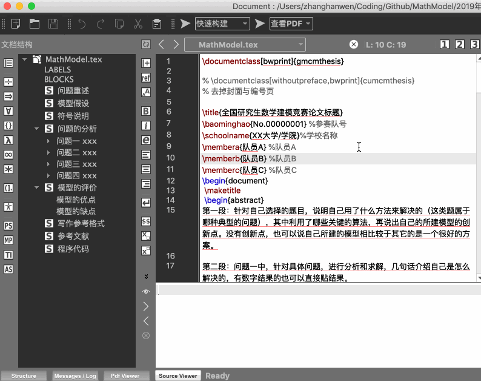

## LaTex 模版使用
1. 下载 `LaTex` 模版文件并解压         
	*LaTex 论文模版：*[**LaTex 论文模版**](https://github.com/zhanwen/MathModel/blob/master/)   
	
2. 解压后的文件目录  
	>2019年Latex模版  
	>&nbsp;&nbsp;&nbsp;&nbsp;— figure   
	>&nbsp;&nbsp;&nbsp;&nbsp;— MathModel.synct.ex.gz  
	>&nbsp;&nbsp;&nbsp;&nbsp;— MathModel.tex  
	>&nbsp;&nbsp;&nbsp;&nbsp;— gmcmthesis.cls  
	>&nbsp;&nbsp;&nbsp;&nbsp;— MathModel.pdf   
	>&nbsp;&nbsp;&nbsp;&nbsp;— .DS_Store（这个文件可以直接删除）   
	>
	>_MACOSX（这个文件可以直接删除）

	目录说明：
	> figure 文件夹存放图片，tex 中使用的图片都可以放到这个文件夹里。图片格式可以是（eps、pdf、png、jpg），这里推荐使用矢量图（eps）。 
	>
	> MathModel.tex 这个文件是最重要的，是存放内容的文件，论文内容全部写到这个文件，具体格式可以参考里面已有的内容。
	>
	> MathModel.pdf 是编译之后的文件，这个文件是由 MathModel.tex 编译出 pdf 文件。
	>
	> gmcmthesis.cls、MathModel.synct.ex.gz 这两个文件暂时不会用到，不用管。
3. 如何编译  
	> 要使用 LaTex，需要两样东西，分别是编译器和编辑器。如果电脑上没有编译器的话，需要去下载。而编辑器基本上电脑都已经有，比如（sublime、notepad、texmaker）。  

	编译器，推荐下载 CTeX。
	> Windows 版本 [**ctex 清华镜像下载**](https://mirrors.tuna.tsinghua.edu.cn/ctex/legacy/2.9/)，选择最大的那个文件下载。
	>
	> Mac 版本 [**MacTex 下载**](http://tug.org/~koch/MacTeX-2019.pkg)，文件比较大，耐心下载，下载完后默认安装即可。

	编辑器，推荐（texmaker、sublime）
	> 其它编辑也可以使用，使用默认自带的也可以。后面演示使用的是 texmaker。
4. 编译
	> 1、安装编辑器之后，可以双击 MathModel.tex 这个文件直接打开。或者把这个文件直接拖到 texmaker。打开文件后看到的界面如下：
	> 
	>
	> 2、下面选择 XeLaTex 进行编译（前提是已经安装了编译器），在最上面的第一个倒三角符号下拉框选择 XeLaTex
	>  
	>
	> 3、编译完成后，打开文件夹（与 MathModel.tex 文件同一个目录下），会发现已经生成对应的 pdf 文件，当然生成的不止是 pdf 文件，还会生成其它相关文件，比如日志文件之类的，其它文件不需要操作。需要的只有 pdf 文件。
5. 关于编译时出现问题
	> 1、如果编译报错，提示字体没有发现，那么去网上下载对应的字体安装即可，下载的字体文件一般是（.ttf）可以直接安装使用。可能会碰倒没有发现华文新魏字体（STxinwei），这个是目前遇到过的一个问题，安装对应的字体可以解决。其它问题暂未发现，如果有遇到请在 Issue 里面提出。
	>
	> **遇到问题请提交到 Issue** [发现问题请点击我](https://github.com/zhanwen/MathModel/issues)
