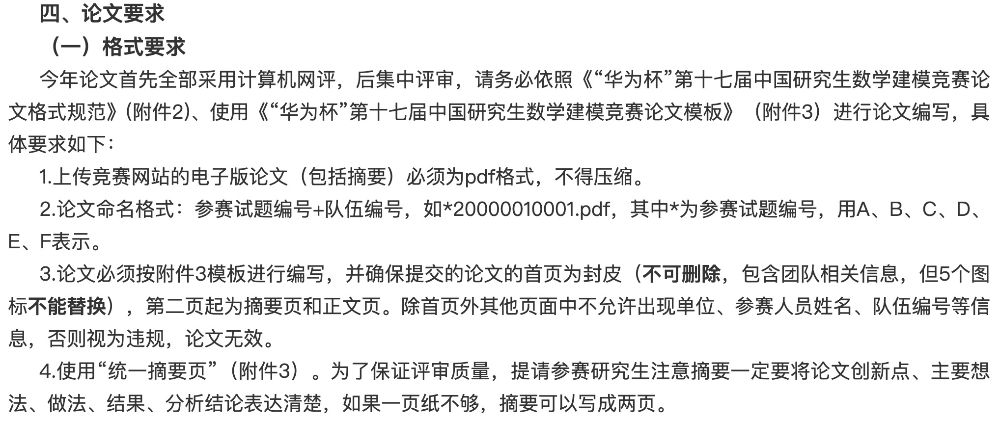

# 2020年“华为杯”第十七届中国研究生数学建模竞赛
#### 官网给出的标准模版是 word 版本，官网对论文模版有要求，请谨慎使用 Latex 模版，在不放心的情况，可以先咨询官方，使用 Latex 生成的 pdf 是否可以过审，下面是官方对论文的要求。

#### 今年论文首次全部采用计算机网评，后集中评审。这个计算机网评具体怎么如何，还不清楚。

#### 使用之前请务必确认。如果有确认过的，可以回复一下，让大家都知道，谢谢。