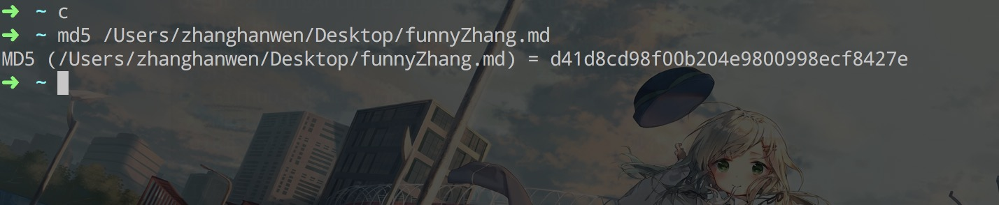
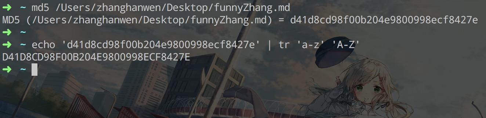

# MD5 文件校验说明和使用
### Windows 系统
Windows 系统使用如下，直接下载本目录下的 `FileMD5.exe` 文件，下载之后直接打开就可以使用，可以通过文件拖拽，直接进行加密，也可以通过浏览目录来进行选择自己需要加载的文件。

### Mac 系统
Mac 系统可以直接打开终端，在终端里面可以直接使用 `md5` 命令，`md5` 使用命令参考。  

	md5: option requires an argument -- s
	usage: md5 [-pqrtx] [-s string] [files ...]
	
在命令行中输入 `md5` 之后，然后将需要加载的文件直接拖到命令中，在进行回车就可以看到结果，如下图所示。

发现这个输出是全部小写，如果需要转换成大写，可以使用管道符，直接将小写转换成大写。  
