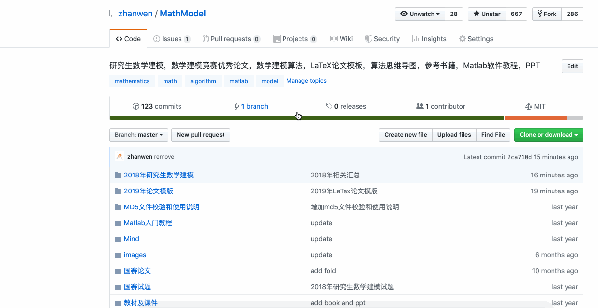
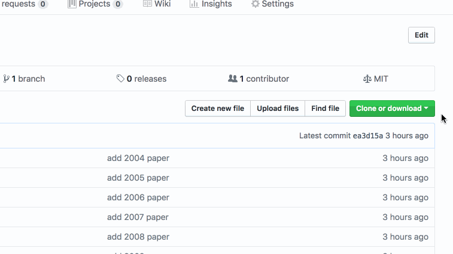
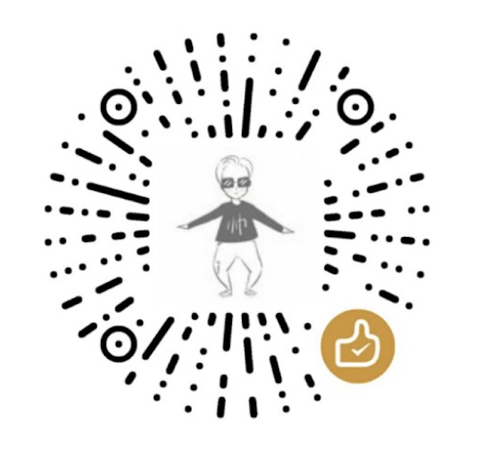
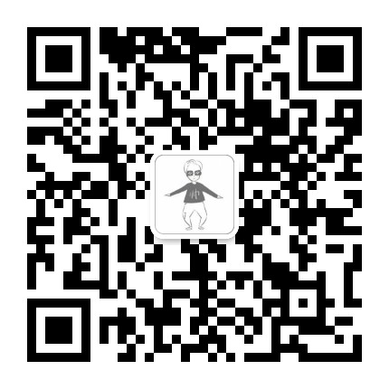

# 数学建模资源

## 更新模块 
* 更新 **[2023年数模建模 第二十届大赛](https://github.com/zhanwen/MathModel/tree/master/2023%E5%B9%B4%E6%95%B0%E6%A8%A1%E6%82%89%E7%9F%A5%26%E8%AE%BA%E6%96%87%E6%A8%A1%E7%89%88)**
* 更新 **[2022年获奖名单](https://github.com/zhanwen/MathModel/tree/master/2022%E5%B9%B4%E6%9C%80%E7%BB%88%E8%8E%B7%E5%A5%96%E5%90%8D%E5%8D%95)**
* 更新 **[2022年研究生数模比赛模版（Word/Latex）](https://github.com/zhanwen/MathModel/tree/master/2022%E5%B9%B4%E6%95%B0%E6%A8%A1%E6%82%89%E7%9F%A5%26%E8%AE%BA%E6%96%87%E6%A8%A1%E7%89%88)**
* 更新 **[2021 年优秀论文](https://github.com/zhanwen/MathModel/tree/master/%E5%9B%BD%E8%B5%9B%E8%AE%BA%E6%96%87/2021%E5%B9%B4%E4%BC%98%E7%A7%80%E8%AE%BA%E6%96%87)**（2022年6月25日）[⏬下载链接](https://pan.baidu.com/s/1j0rqd6tvKv4LxGRG0kUaKw)，key:`eyzf`
* 更新 **[2022年研究生数模比赛通知](https://github.com/zhanwen/MathModel/tree/master/2022%E5%B9%B4%E6%95%B0%E6%A8%A1%E6%82%89%E7%9F%A5%26%E8%AE%BA%E6%96%87%E6%A8%A1%E7%89%88)**
* ----------------以下是历史更新版本----------------
* 更新 **[2021年获奖名单](https://github.com/zhanwen/MathModel/tree/master/2021%E5%B9%B4%E6%9C%80%E7%BB%88%E8%8E%B7%E5%A5%96%E5%90%8D%E5%8D%95)**
* 更新 **[2021年研究生数学建模竞赛试题](https://github.com/zhanwen/MathModel/tree/master/%E5%9B%BD%E8%B5%9B%E8%AF%95%E9%A2%98/2021%E5%B9%B4%E7%A0%94%E7%A9%B6%E7%94%9F%E6%95%B0%E5%AD%A6%E5%BB%BA%E6%A8%A1%E7%AB%9E%E8%B5%9B%E8%AF%95%E9%A2%98)**
* 更新 **[2021年论文模版](https://github.com/zhanwen/MathModel/tree/master/2021%E5%B9%B4%E6%95%B0%E6%A8%A1%E6%82%89%E7%9F%A5%26%E8%AE%BA%E6%96%87%E6%A8%A1%E7%89%88)**（包括 word 版本、Latex 版本） 
* 更新 **[数学建模网论坛上提问](https://www.shumo.com/home/html/category/cpmcm)**（比赛期间，论坛解答）   
* 更新 **[2020 年优秀论文](https://github.com/zhanwen/MathModel/tree/master/%E5%9B%BD%E8%B5%9B%E8%AE%BA%E6%96%87/2020%E5%B9%B4%E4%BC%98%E7%A7%80%E8%AE%BA%E6%96%87)**（2021年8月21日）[⏬下载链接](https://pan.baidu.com/s/1NK3_QXdU6gPH27_gABMUIw)，key:`odt5`
* 更新 **[2020年论文模版](https://github.com/zhanwen/MathModel/tree/master/2020%E5%B9%B4%E8%AE%BA%E6%96%87%E6%A8%A1%E7%89%88)**（包括 word 版本、Latex 版本） 
* 更新 **[2019 年优秀论文](https://github.com/zhanwen/MathModel/tree/master/%E5%9B%BD%E8%B5%9B%E8%AE%BA%E6%96%87/2019%E5%B9%B4%E4%BC%98%E7%A7%80%E8%AE%BA%E6%96%87)**（2020年7月21日）[⏬下载链接](https://pan.baidu.com/s/1xt8R7ad_o7zBEZGZvqA3MA)，key:`2uyl`
* 2019年“华为杯”第十六届中国研究生数学建模竞赛——**选题、命题介绍分析：** [**选题、命题介绍分析**](https://github.com/zhanwen/MathModel/blob/master/%E9%80%89%E9%A2%98%E3%80%81%E5%91%BD%E9%A2%98%E4%BB%8B%E7%BB%8D%E5%88%86%E6%9E%90.md)
* **所有文件下载地址更新到微盘：[微盘下载](https://share.weiyun.com/Lk0sE1o4)，key：`uzw9mf`**
* 同步所有文件到[百度云网盘](https://pan.baidu.com/s/1dOl-MRXtkLBU2l_UWPpYdA)，key:`bxdy`（2020年6月24日）
* 百度云备用链接1: [点击下载](https://pan.baidu.com/s/1t6KIxwGky0p_1STrIxOQMQ)，key:`0rm9`
* 百度云备用链接2: [点击下载](https://pan.baidu.com/s/1nO2oCk2_Dt8ED7Ff1IZ61w)，key:`5s6y`
* 百度云备用链接3: [点击下载](https://pan.baidu.com/s/1eOq1-YcU3OGvlsenNQrmXw)，key:`29vl`

## 2023 年研究生数模 (新)
*LaTex 论文模版使用方式：* [**如何编译 Latex 文件**](https://github.com/zhanwen/MathModel/blob/master/2019%E5%B9%B4%E8%AE%BA%E6%96%87%E6%A8%A1%E7%89%88/README.md)（Latex 模版一般在官方给出 word 模版后更新，时间大概在比赛前一星期左右）

*主题：* [**“华为杯”第二十届中国研究生数学建模竞赛**](https://cpipc.acge.org.cn/cw/hp/4)（只允许2023级跨校组队，大家注意一下。）  

*报名时间：* **2023年6月1日8:00——9月17日17:00**  
*审核时间：* **2023年6月1日8:00——9月18日17:00**   
*交费时间：* **2023年6月1日8:00——9月19日17:00**     
*比赛时间：* **2023年9月22日8:00——9月26日12:00**  
*上传论文MD5码时间：* **2023年9月25日12:00——9月26日12:00**    
*上传PDF格式论文时间：* **2023年9月26日14:00——9月27日24:00**
#### 官网报名地址：[官网地址](https://cpipc.acge.org.cn/cw/hp/4)

  

## 2022 年研究生数模
#### 2022.12.30 比赛结果公示，[获奖名单](https://github.com/zhanwen/MathModel/tree/master/2022%E5%B9%B4%E6%9C%80%E7%BB%88%E8%8E%B7%E5%A5%96%E5%90%8D%E5%8D%95)

#### 2022.10.6—2022.10.10 比赛已经结束，大家耐心等待获奖吧（(o^^o)）
*MD5文件校验和使用说明：* [**论文提交（MD5使用方法）**](https://github.com/zhanwen/MathModel/blob/master/MD5%E6%96%87%E4%BB%B6%E6%A0%A1%E9%AA%8C%E5%92%8C%E4%BD%BF%E7%94%A8%E8%AF%B4%E6%98%8E/%E4%BD%BF%E7%94%A8%E8%AF%B4%E6%98%8E.md)

*LaTex 论文模版使用方式：* [**如何编译 Latex 文件**](https://github.com/zhanwen/MathModel/blob/master/2019%E5%B9%B4%E8%AE%BA%E6%96%87%E6%A8%A1%E7%89%88/README.md)（Latex 模版一般在官方给出 word 模版后更新，时间大概在比赛前一星期左右）

*主题：* [**“华为杯”第十九届中国研究生数学建模竞赛**](https://cpipc.acge.org.cn/cw/hp/4)（只允许2022级跨校组队，大家注意一下。）  

*报名时间：* <del>**2022年6月1日8:00——9月14日17:00**</del> 截止：2022年09月26日17:00   
*审核时间：* <del>**2022年6月1日8:00——9月16日17:00**</del> 截止：2022年09月27日17:00     
*交费时间：* <del>**2022年6月1日8:00——9月19日17:00**</del> 截止：2022年09月30日17:00  
*比赛时间：* <del>**2022年9月22日8:00——9月26日12:00**</del> 2022年10月06日8:00——10月10日12:00  
*上传论文MD5码时间：* <del>**2022年9月25日12:00——9月26日12:00**</del> 2022年10月09日12:00——10月10日12:00   
*上传PDF格式论文时间：* <del>**2022年9月26日14:00——9月27日24:00**</del> 2022年10月10日14:00——10月11日24:00   
#### 官网报名地址：[官网地址](https://cpipc.acge.org.cn/cw/hp/4)

  

## 2021 年研究生数模 
#### 2021.12.10 比赛结果公示，[获奖名单](https://github.com/zhanwen/MathModel/tree/master/2021%E5%B9%B4%E6%9C%80%E7%BB%88%E8%8E%B7%E5%A5%96%E5%90%8D%E5%8D%95)
#### 2021.10.14—2021.10.28 比赛已经结束，大家耐心等待获奖吧（(o^^o)）
#### 2021.10.13 明天早八点开始，祝大家比赛开心 （^_^）
*MD5文件校验和使用说明：* [**论文提交（MD5使用方法）**](https://github.com/zhanwen/MathModel/blob/master/MD5%E6%96%87%E4%BB%B6%E6%A0%A1%E9%AA%8C%E5%92%8C%E4%BD%BF%E7%94%A8%E8%AF%B4%E6%98%8E/%E4%BD%BF%E7%94%A8%E8%AF%B4%E6%98%8E.md)

*LaTex 论文模版使用方式：* [**如何编译 Latex 文件**](https://github.com/zhanwen/MathModel/blob/master/2019%E5%B9%B4%E8%AE%BA%E6%96%87%E6%A8%A1%E7%89%88/README.md)

*主题：* [**“华为杯”第十八届中国研究生数学建模竞赛**](https://cpipc.acge.org.cn/cw/hp/4)（只允许2021级跨校组队，大家注意一下。）  
引用官网原文：由于今年的新冠疫情形势导致部分高校的工作安排较往年同期有一定变化，教学科研进度也相应作出调整。为让意向参赛的师生有更加充裕的时间报名、备赛，经研究决定，现对原定的各时间节点予以延期。[延期举办等相关事宜的通知](https://cpipc.acge.org.cn//cw/detail/4/2c9080127bca23bf017bca55e4060317)

*报名时间：* <del>**2021年6月1日8:00——9月10日17:00**</del> 截止：2021年10月8日17:00  
*审核时间：* <del>**2021年6月1日8:00——9月12日17:00**</del>   截止：2021年10月10日17:00  
*交费时间：* <del>**2021年6月6日8:00——9月13日17:00**</del>   截止：2021年10月11日17:00  
*比赛时间：* <del>**2021年9月16日8:00——9月20日12:00**</del>  2021年10月14日8:00——10月18日12:00  
#### 官网报名地址：[官网地址](https://cpipc.acge.org.cn/cw/hp/4)

  

## 2020 年研究生数模
#### 2020.11.24 今年比去年晚两个礼拜，比赛结果经过一个半月的评审，在这一天公布了[获奖名单](https://github.com/zhanwen/MathModel/tree/master/2020%E5%B9%B4%E6%9C%80%E7%BB%88%E8%8E%B7%E5%A5%96%E5%90%8D%E5%8D%95)，大家的努力相信都会有所收获。余生还有很多有意义的事情需要我们去做，让我们一起努力吧。(o^o)

#### 预告一下，按照往年成绩公布时间，应该是在双十一那天。要么喜上加喜，要么少买点东西 (o^^o)。

#### 论文提交（MD5使用方法）
*MD5文件校验和使用说明：* [**MD5文件校验和使用说明**](https://github.com/zhanwen/MathModel/blob/master/MD5%E6%96%87%E4%BB%B6%E6%A0%A1%E9%AA%8C%E5%92%8C%E4%BD%BF%E7%94%A8%E8%AF%B4%E6%98%8E/%E4%BD%BF%E7%94%A8%E8%AF%B4%E6%98%8E.md)
#### 论文模版更新
 
*LaTex 论文模版使用方式：* [**如何编译 Latex 文件**](https://github.com/zhanwen/MathModel/blob/master/2019%E5%B9%B4%E8%AE%BA%E6%96%87%E6%A8%A1%E7%89%88/README.md)

*主题：* [**“华为杯”第十七届中国研究生数学建模竞赛**](https://cpipc.chinadegrees.cn/cw/hp/4)（今年不允许跨校组队，大家注意一下。）  
*报名时间：* **2020年6月1日8:00——9月10日17:00**  
*审核时间：* **2020年6月1日8:00——9月13日17:00**   
*交费时间：* **2020年7月1日8:00——9月14日17:00**    
*比赛时间：* **2020年9月17日8:00——9月21日12:00**    
#### 官网报名地址：[官网地址](https://cpipc.chinadegrees.cn/cw/hp/4)

  

## 2019 年研究生数模
#### 2019.11.11 又是双十一，比赛结果经过一个半月的评审，在这一天公布了[获奖名单](2019%E5%B9%B4%E6%9C%80%E7%BB%88%E8%8E%B7%E5%A5%96%E5%90%8D%E5%8D%95)，大家的努力相信都会有所收获。余生还有很多有意义的事情需要我们去做，让我们一起努力。(o^o)
### 2019.9.19—2019.9.23 比赛已经结束，大家耐心等待获奖吧（(o^^o)）
#### 论文提交（MD5使用方法）
*MD5文件校验和使用说明：* [**MD5文件校验和使用说明**](https://github.com/zhanwen/MathModel/blob/master/MD5%E6%96%87%E4%BB%B6%E6%A0%A1%E9%AA%8C%E5%92%8C%E4%BD%BF%E7%94%A8%E8%AF%B4%E6%98%8E/%E4%BD%BF%E7%94%A8%E8%AF%B4%E6%98%8E.md)
#### 论文模版更新
*LaTex 论文模版：* [**LaTex 论文模版**](https://github.com/zhanwen/MathModel/blob/master/2019%E5%B9%B4%E8%AE%BA%E6%96%87%E6%A8%A1%E7%89%88/2019%E5%B9%B4Latex%E6%A8%A1%E7%89%88.zip)  
*Word 论文模版：* [**Word 论文模版（已更新最新）**](https://github.com/zhanwen/MathModel/blob/master/2019%E5%B9%B4%E8%AE%BA%E6%96%87%E6%A8%A1%E7%89%88/%E2%80%9C%E5%8D%8E%E4%B8%BA%E6%9D%AF%E2%80%9D%E7%AC%AC%E5%8D%81%E5%85%AD%E5%B1%8A%E4%B8%AD%E5%9B%BD%E7%A0%94%E7%A9%B6%E7%94%9F%E6%95%B0%E5%AD%A6%E5%BB%BA%E6%A8%A1%E7%AB%9E%E8%B5%9B%E8%AE%BA%E6%96%87%E6%A0%BC%E5%BC%8F%E8%A7%84%E8%8C%83.doc)  
*LaTex 论文模版使用方式：* [**如何编译 Latex 文件**](https://github.com/zhanwen/MathModel/tree/master/2019%E5%B9%B4%E8%AE%BA%E6%96%87%E6%A8%A1%E7%89%88/latex_note.md)
#### 下载方式(仓库比较大，建议单个文件下载)  

 
 

  

*主题：* [**“华为杯”第十六届中国研究生数学建模竞赛**](https://cpipc.chinadegrees.cn/cw/hp/4)  
*报名时间：* **2019年6月1日8:00——9月10日17:00**  
*审核时间：* **2019年6月1日8:00——9月12日17:00**   
*交费时间：* **2019年7月1日8:00——9月15日17:00**    
*比赛时间：* **2019年9月19日8:00——9月23日12:00**    
#### 官网报名地址：[官网地址](https://cpipc.chinadegrees.cn/cw/hp/4)

  
   
### 2018.9.15 祝大家比赛开心 （^_^）
### 2018.9.19 比赛已经结束，大家耐心等待获奖吧（^o^）
#### 2018.11.11 比赛结果经过一个半月的评审，终于在昨天公布了[获奖名单](https://github.com/zhanwen/MathModel/tree/master/2018%E5%B9%B4%E7%A0%94%E7%A9%B6%E7%94%9F%E6%95%B0%E5%AD%A6%E5%BB%BA%E6%A8%A1/2018%E5%B9%B4%E6%9C%80%E7%BB%88%E8%8E%B7%E5%A5%96%E5%90%8D%E5%8D%95)，大家的努力相信都会有所收获。余生还有很多有意义的事情需要我们去做，让我们一起努力。(o^^o)

  

#### 更新/添加比赛官网地址[戳这里](https://cpipc.chinadegrees.cn/)   
* [数学建模竞赛](https://cpipc.chinadegrees.cn/cw/hp/4)     
* [电子设计竞赛](https://cpipc.chinadegrees.cn/cw/hp/6)     
* [人工智能创新大赛](https://cpipc.chinadegrees.cn/cw/hp/2c9088a5696cbf370169a3f8101510bd)     
* [机器人创新设计大赛](https://cpipc.chinadegrees.cn/cw/hp/2c9088a5696cbf370169a3f8934810be)

### 下载与使用（由于整个项目直接下载比较慢，可以看方式四）
* 方式一：使用 `git` 下载。   
`git clone https://github.com/zhanwen/MathModel.git`

* 方式二：直接下载压缩包。  

* 方式三
	* 可以单个文件下载，选择自己需要的某篇论文，直接在对应的页面点击下载即可。

* 方式四：百度云下载（推荐）
	* 使用百度云下载，正常的客户端会出现限速，导致下载的很慢，这里给大家推荐一个绕过百度云下载限速的方式。具体怎么下载，请参照 [绕过限速](https://github.com/GangZhuo/BaiduPCS)。
	* 该项目的百度云链接 [https://pan.baidu.com/s/1wcCcc8pICGx5mBiwP6jwnw](https://pan.baidu.com/s/1wcCcc8pICGx5mBiwP6jwnw)，密码：`7sog`
	* **更新：这个链接失效没影响，直接访问这个网址[绕过限速](https://github.com/GangZhuo/BaiduPCS)，看 README 部分，有针对不同操作系统安装方法，根据自己的操作系统安装即可，大部分方式都是将项目git clone，在后续。**

### 国赛试题
* [2021年研究生数学建模竞赛试题](https://github.com/zhanwen/MathModel/tree/master/%E5%9B%BD%E8%B5%9B%E8%AF%95%E9%A2%98/2021%E5%B9%B4%E7%A0%94%E7%A9%B6%E7%94%9F%E6%95%B0%E5%AD%A6%E5%BB%BA%E6%A8%A1%E7%AB%9E%E8%B5%9B%E8%AF%95%E9%A2%98)
* [2020年研究生数学建模竞赛试题](https://github.com/zhanwen/MathModel/tree/master/%E5%9B%BD%E8%B5%9B%E8%AF%95%E9%A2%98/2020%E5%B9%B4%E7%A0%94%E7%A9%B6%E7%94%9F%E6%95%B0%E5%AD%A6%E5%BB%BA%E6%A8%A1%E7%AB%9E%E8%B5%9B%E8%AF%95%E9%A2%98)
* [2019年研究生数学建模竞赛试题](https://github.com/zhanwen/MathModel/tree/master/%E5%9B%BD%E8%B5%9B%E8%AF%95%E9%A2%98/2019%E5%B9%B4%E7%A0%94%E7%A9%B6%E7%94%9F%E6%95%B0%E5%AD%A6%E5%BB%BA%E6%A8%A1%E7%AB%9E%E8%B5%9B%E8%AF%95%E9%A2%98)
* [2018年研究生数学建模竞赛试题](https://github.com/zhanwen/MathModel/tree/master/%E5%9B%BD%E8%B5%9B%E8%AF%95%E9%A2%98/2018%E5%B9%B4%E7%A0%94%E7%A9%B6%E7%94%9F%E6%95%B0%E5%AD%A6%E5%BB%BA%E6%A8%A1%E7%AB%9E%E8%B5%9B%E8%AF%95%E9%A2%98)
* [2017年研究生数学建模竞赛试题](https://github.com/zhanwen/MathModel/tree/master/%E5%9B%BD%E8%B5%9B%E8%AF%95%E9%A2%98/2017%E5%B9%B4%E7%A0%94%E7%A9%B6%E7%94%9F%E6%95%B0%E5%AD%A6%E5%BB%BA%E6%A8%A1%E7%AB%9E%E8%B5%9B%E8%AF%95%E9%A2%98)
* [2016年研究生数学建模竞赛试题](https://github.com/zhanwen/MathModel/tree/master/%E5%9B%BD%E8%B5%9B%E8%AF%95%E9%A2%98/2016%E5%B9%B4%E7%A0%94%E7%A9%B6%E7%94%9F%E6%95%B0%E5%AD%A6%E5%BB%BA%E6%A8%A1%E7%AB%9E%E8%B5%9B%E8%AF%95%E9%A2%98)
* [2015年研究生数学建模竞赛试题](https://github.com/zhanwen/MathModel/tree/master/%E5%9B%BD%E8%B5%9B%E8%AF%95%E9%A2%98/2015%E5%B9%B4%E7%A0%94%E7%A9%B6%E7%94%9F%E6%95%B0%E5%AD%A6%E5%BB%BA%E6%A8%A1%E7%AB%9E%E8%B5%9B%E8%AF%95%E9%A2%98)
* [2014年研究生数学建模竞赛试题](https://github.com/zhanwen/MathModel/tree/master/%E5%9B%BD%E8%B5%9B%E8%AF%95%E9%A2%98/2014%E5%B9%B4%E7%A0%94%E7%A9%B6%E7%94%9F%E6%95%B0%E5%AD%A6%E5%BB%BA%E6%A8%A1%E7%AB%9E%E8%B5%9B%E8%AF%95%E9%A2%98)
* [2013年研究生数学建模竞赛试题](https://github.com/zhanwen/MathModel/tree/master/%E5%9B%BD%E8%B5%9B%E8%AF%95%E9%A2%98/2013%E5%B9%B4%E7%A0%94%E7%A9%B6%E7%94%9F%E6%95%B0%E5%AD%A6%E5%BB%BA%E6%A8%A1%E7%AB%9E%E8%B5%9B%E8%AF%95%E9%A2%98)
* [2012年研究生数学建模竞赛试题](https://github.com/zhanwen/MathModel/tree/master/%E5%9B%BD%E8%B5%9B%E8%AF%95%E9%A2%98/2012%E5%B9%B4%E7%A0%94%E7%A9%B6%E7%94%9F%E6%95%B0%E5%AD%A6%E5%BB%BA%E6%A8%A1%E7%AB%9E%E8%B5%9B%E8%AF%95%E9%A2%98)
* [2011年研究生数学建模竞赛试题](https://github.com/zhanwen/MathModel/tree/master/%E5%9B%BD%E8%B5%9B%E8%AF%95%E9%A2%98/2011%E5%B9%B4%E7%A0%94%E7%A9%B6%E7%94%9F%E6%95%B0%E5%AD%A6%E5%BB%BA%E6%A8%A1%E7%AB%9E%E8%B5%9B%E8%AF%95%E9%A2%98)
* [2010年研究生数学建模竞赛试题](https://github.com/zhanwen/MathModel/tree/master/%E5%9B%BD%E8%B5%9B%E8%AF%95%E9%A2%98/2010%E5%B9%B4%E7%A0%94%E7%A9%B6%E7%94%9F%E6%95%B0%E5%AD%A6%E5%BB%BA%E6%A8%A1%E7%AB%9E%E8%B5%9B%E8%AF%95%E9%A2%98)
* [2009年研究生数学建模竞赛试题](https://github.com/zhanwen/MathModel/tree/master/%E5%9B%BD%E8%B5%9B%E8%AF%95%E9%A2%98/2009%E5%B9%B4%E7%A0%94%E7%A9%B6%E7%94%9F%E6%95%B0%E5%AD%A6%E5%BB%BA%E6%A8%A1%E7%AB%9E%E8%B5%9B%E8%AF%95%E9%A2%98)
* [2008年研究生数学建模竞赛试题](https://github.com/zhanwen/MathModel/tree/master/%E5%9B%BD%E8%B5%9B%E8%AF%95%E9%A2%98/2008%E5%B9%B4%E7%A0%94%E7%A9%B6%E7%94%9F%E6%95%B0%E5%AD%A6%E5%BB%BA%E6%A8%A1%E7%AB%9E%E8%B5%9B%E8%AF%95%E9%A2%98)
* [2007年研究生数学建模竞赛试题](https://github.com/zhanwen/MathModel/tree/master/%E5%9B%BD%E8%B5%9B%E8%AF%95%E9%A2%98/2007%E5%B9%B4%E7%A0%94%E7%A9%B6%E7%94%9F%E6%95%B0%E5%AD%A6%E5%BB%BA%E6%A8%A1%E7%AB%9E%E8%B5%9B%E8%AF%95%E9%A2%98)
* [2006年研究生数学建模竞赛试题](https://github.com/zhanwen/MathModel/tree/master/%E5%9B%BD%E8%B5%9B%E8%AF%95%E9%A2%98/2006%E5%B9%B4%E7%A0%94%E7%A9%B6%E7%94%9F%E6%95%B0%E5%AD%A6%E5%BB%BA%E6%A8%A1%E7%AB%9E%E8%B5%9B%E8%AF%95%E9%A2%98)
* [2005年研究生数学建模竞赛试题](https://github.com/zhanwen/MathModel/tree/master/%E5%9B%BD%E8%B5%9B%E8%AF%95%E9%A2%98/2005%E5%B9%B4%E7%A0%94%E7%A9%B6%E7%94%9F%E6%95%B0%E5%AD%A6%E5%BB%BA%E6%A8%A1%E7%AB%9E%E8%B5%9B%E8%AF%95%E9%A2%98)
* [2004年研究生数学建模竞赛试题](https://github.com/zhanwen/MathModel/tree/master/%E5%9B%BD%E8%B5%9B%E8%AF%95%E9%A2%98/2004%E5%B9%B4%E7%A0%94%E7%A9%B6%E7%94%9F%E6%95%B0%E5%AD%A6%E5%BB%BA%E6%A8%A1%E7%AB%9E%E8%B5%9B%E8%AF%95%E9%A2%98)

### 国赛论文
* [2021年优秀论文](https://github.com/zhanwen/MathModel/tree/master/%E5%9B%BD%E8%B5%9B%E8%AE%BA%E6%96%87/2021%E5%B9%B4%E4%BC%98%E7%A7%80%E8%AE%BA%E6%96%87)
	* [A题：相关矩阵组的低复杂度计算和存储建模](https://github.com/zhanwen/MathModel/tree/master/%E5%9B%BD%E8%B5%9B%E8%AE%BA%E6%96%87/2021%E5%B9%B4%E4%BC%98%E7%A7%80%E8%AE%BA%E6%96%87/A)
	* [B题：空气质量预报二次建模](https://github.com/zhanwen/MathModel/tree/master/%E5%9B%BD%E8%B5%9B%E8%AE%BA%E6%96%87/2021%E5%B9%B4%E4%BC%98%E7%A7%80%E8%AE%BA%E6%96%87/B)
	* [C题：帕金森病的脑深部电刺激治疗建模研究](https://github.com/zhanwen/MathModel/tree/master/%E5%9B%BD%E8%B5%9B%E8%AE%BA%E6%96%87/2021%E5%B9%B4%E4%BC%98%E7%A7%80%E8%AE%BA%E6%96%87/C)
	* [D题：抗胰腺癌候选药物的优化建模](https://github.com/zhanwen/MathModel/tree/master/%E5%9B%BD%E8%B5%9B%E8%AE%BA%E6%96%87/2021%E5%B9%B4%E4%BC%98%E7%A7%80%E8%AE%BA%E6%96%87/D)
	* [E题：信号干扰下的超宽带（UWB）精确定位问题](https://github.com/zhanwen/MathModel/tree/master/%E5%9B%BD%E8%B5%9B%E8%AE%BA%E6%96%87/2021%E5%B9%B4%E4%BC%98%E7%A7%80%E8%AE%BA%E6%96%87/E)
	* [F题：航空公司机组优化排班问题](https://github.com/zhanwen/MathModel/tree/master/%E5%9B%BD%E8%B5%9B%E8%AE%BA%E6%96%87/2021%E5%B9%B4%E4%BC%98%E7%A7%80%E8%AE%BA%E6%96%87/F)

* [2020年优秀论文](https://github.com/zhanwen/MathModel/tree/master/%E5%9B%BD%E8%B5%9B%E8%AE%BA%E6%96%87/2020%E5%B9%B4%E4%BC%98%E7%A7%80%E8%AE%BA%E6%96%87)
	* [A题：华为题_芯片相噪算法设计](https://github.com/zhanwen/MathModel/tree/master/%E5%9B%BD%E8%B5%9B%E8%AE%BA%E6%96%87/2020%E5%B9%B4%E4%BC%98%E7%A7%80%E8%AE%BA%E6%96%87/A)
	* [B题：汽油辛烷值建模](https://github.com/zhanwen/MathModel/tree/master/%E5%9B%BD%E8%B5%9B%E8%AE%BA%E6%96%87/2020%E5%B9%B4%E4%BC%98%E7%A7%80%E8%AE%BA%E6%96%87/B)
	* [C题：面向康复工程的脑电信号分析和判别模型](https://github.com/zhanwen/MathModel/tree/master/%E5%9B%BD%E8%B5%9B%E8%AE%BA%E6%96%87/2020%E5%B9%B4%E4%BC%98%E7%A7%80%E8%AE%BA%E6%96%87/C)
	* [D题：无人机集群协同对抗](https://github.com/zhanwen/MathModel/tree/master/%E5%9B%BD%E8%B5%9B%E8%AE%BA%E6%96%87/2020%E5%B9%B4%E4%BC%98%E7%A7%80%E8%AE%BA%E6%96%87/D)
	* [E题：能见度估计与预测](https://github.com/zhanwen/MathModel/tree/master/%E5%9B%BD%E8%B5%9B%E8%AE%BA%E6%96%87/2020%E5%B9%B4%E4%BC%98%E7%A7%80%E8%AE%BA%E6%96%87/E)
	* [F题：飞行器质心平衡供油策略优化](https://github.com/zhanwen/MathModel/tree/master/%E5%9B%BD%E8%B5%9B%E8%AE%BA%E6%96%87/2020%E5%B9%B4%E4%BC%98%E7%A7%80%E8%AE%BA%E6%96%87/F)

* [2019年优秀论文](https://github.com/zhanwen/MathModel/tree/master/%E5%9B%BD%E8%B5%9B%E8%AE%BA%E6%96%87/2019%E5%B9%B4%E4%BC%98%E7%A7%80%E8%AE%BA%E6%96%87)
	* [A题：无线智能传播模型](https://github.com/zhanwen/MathModel/tree/master/%E5%9B%BD%E8%B5%9B%E8%AE%BA%E6%96%87/2019%E5%B9%B4%E4%BC%98%E7%A7%80%E8%AE%BA%E6%96%87/A)
	* [B题：天文导航中的星图识别](https://github.com/zhanwen/MathModel/tree/master/%E5%9B%BD%E8%B5%9B%E8%AE%BA%E6%96%87/2019%E5%B9%B4%E4%BC%98%E7%A7%80%E8%AE%BA%E6%96%87/B)
	* [C题：视觉情报信息分析](https://github.com/zhanwen/MathModel/tree/master/%E5%9B%BD%E8%B5%9B%E8%AE%BA%E6%96%87/2019%E5%B9%B4%E4%BC%98%E7%A7%80%E8%AE%BA%E6%96%87/C)
	* [D题：汽车行驶工况构建](https://github.com/zhanwen/MathModel/tree/master/%E5%9B%BD%E8%B5%9B%E8%AE%BA%E6%96%87/2019%E5%B9%B4%E4%BC%98%E7%A7%80%E8%AE%BA%E6%96%87/D)
	* [E题：多全球变暖气候预测分析](https://github.com/zhanwen/MathModel/tree/master/%E5%9B%BD%E8%B5%9B%E8%AE%BA%E6%96%87/2019%E5%B9%B4%E4%BC%98%E7%A7%80%E8%AE%BA%E6%96%87/E)
	* [F题：多约束条件下智能飞行器航迹快速规划](https://github.com/zhanwen/MathModel/tree/master/%E5%9B%BD%E8%B5%9B%E8%AE%BA%E6%96%87/2019%E5%B9%B4%E4%BC%98%E7%A7%80%E8%AE%BA%E6%96%87/F)

* [2018年优秀论文](https://github.com/zhanwen/MathModel/tree/master/%E5%9B%BD%E8%B5%9B%E8%AE%BA%E6%96%87/2018%E5%B9%B4%E4%BC%98%E7%A7%80%E8%AE%BA%E6%96%87)
	* [A题：关于跳台跳水体型系数设置的建模分析](https://github.com/zhanwen/MathModel/tree/master/%E5%9B%BD%E8%B5%9B%E8%AE%BA%E6%96%87/2018%E5%B9%B4%E4%BC%98%E7%A7%80%E8%AE%BA%E6%96%87/A)
	* [B题：光传送网建模与价值评估](https://github.com/zhanwen/MathModel/tree/master/%E5%9B%BD%E8%B5%9B%E8%AE%BA%E6%96%87/2018%E5%B9%B4%E4%BC%98%E7%A7%80%E8%AE%BA%E6%96%87/B)
	* [C题：对恐怖袭击事件记录数据的量化分析](https://github.com/zhanwen/MathModel/tree/master/%E5%9B%BD%E8%B5%9B%E8%AE%BA%E6%96%87/2018%E5%B9%B4%E4%BC%98%E7%A7%80%E8%AE%BA%E6%96%87/C)
	* [D题：基于卫星高度计海面高度异常资料获取潮汐调和常数方法及应用](https://github.com/zhanwen/MathModel/tree/master/%E5%9B%BD%E8%B5%9B%E8%AE%BA%E6%96%87/2018%E5%B9%B4%E4%BC%98%E7%A7%80%E8%AE%BA%E6%96%87/D)
	* [E题：多无人机对组网雷达的协同干扰](https://github.com/zhanwen/MathModel/tree/master/%E5%9B%BD%E8%B5%9B%E8%AE%BA%E6%96%87/2018%E5%B9%B4%E4%BC%98%E7%A7%80%E8%AE%BA%E6%96%87/E)
	* [F题：航站楼扩增评估](https://github.com/zhanwen/MathModel/tree/master/%E5%9B%BD%E8%B5%9B%E8%AE%BA%E6%96%87/2018%E5%B9%B4%E4%BC%98%E7%A7%80%E8%AE%BA%E6%96%87/F)

* [2017年优秀论文](https://github.com/zhanwen/MathModel/tree/master/%E5%9B%BD%E8%B5%9B%E8%AE%BA%E6%96%87/2017%E5%B9%B4%E4%BC%98%E7%A7%80%E8%AE%BA%E6%96%87)
	* [A题：无人机在抢险救灾中的优化运用](https://github.com/zhanwen/MathModel/tree/master/%E5%9B%BD%E8%B5%9B%E8%AE%BA%E6%96%87/2017%E5%B9%B4%E4%BC%98%E7%A7%80%E8%AE%BA%E6%96%87/A)
	* [B题：面向下一代光通信的 VCSEL 激光器仿真模型](https://github.com/zhanwen/MathModel/tree/master/%E5%9B%BD%E8%B5%9B%E8%AE%BA%E6%96%87/2017%E5%B9%B4%E4%BC%98%E7%A7%80%E8%AE%BA%E6%96%87/B)
	* [C题：航班恢复问题](https://github.com/zhanwen/MathModel/tree/master/%E5%9B%BD%E8%B5%9B%E8%AE%BA%E6%96%87/2017%E5%B9%B4%E4%BC%98%E7%A7%80%E8%AE%BA%E6%96%87/C)
	* [D题：基于监控视频的前景目标提取](https://github.com/zhanwen/MathModel/tree/master/%E5%9B%BD%E8%B5%9B%E8%AE%BA%E6%96%87/2017%E5%B9%B4%E4%BC%98%E7%A7%80%E8%AE%BA%E6%96%87/D)
	* [E题：多波次导弹发射中的规划问题](https://github.com/zhanwen/MathModel/tree/master/%E5%9B%BD%E8%B5%9B%E8%AE%BA%E6%96%87/2017%E5%B9%B4%E4%BC%98%E7%A7%80%E8%AE%BA%E6%96%87/E)
	* [F题：地下物流系统网络](https://github.com/zhanwen/MathModel/tree/master/%E5%9B%BD%E8%B5%9B%E8%AE%BA%E6%96%87/2017%E5%B9%B4%E4%BC%98%E7%A7%80%E8%AE%BA%E6%96%87/F)
* [2016年优秀论文](https://github.com/zhanwen/MathModel/tree/master/%E5%9B%BD%E8%B5%9B%E8%AE%BA%E6%96%87/2016%E5%B9%B4%E4%BC%98%E7%A7%80%E8%AE%BA%E6%96%87)
	* [A题：多无人机协同任务规划](https://github.com/zhanwen/MathModel/tree/master/%E5%9B%BD%E8%B5%9B%E8%AE%BA%E6%96%87/2016%E5%B9%B4%E4%BC%98%E7%A7%80%E8%AE%BA%E6%96%87/A) 
	* [B题：具有遗传性疾病和性状的遗传位点分析](https://github.com/zhanwen/MathModel/tree/master/%E5%9B%BD%E8%B5%9B%E8%AE%BA%E6%96%87/2016%E5%B9%B4%E4%BC%98%E7%A7%80%E8%AE%BA%E6%96%87/B)
	* [C题：基于无线通信基站的室内三维定位问题](https://github.com/zhanwen/MathModel/tree/master/%E5%9B%BD%E8%B5%9B%E8%AE%BA%E6%96%87/2016%E5%B9%B4%E4%BC%98%E7%A7%80%E8%AE%BA%E6%96%87/C)
	* [D题：军事行动避空侦察的时机和路线选择](https://github.com/zhanwen/MathModel/tree/master/%E5%9B%BD%E8%B5%9B%E8%AE%BA%E6%96%87/2016%E5%B9%B4%E4%BC%98%E7%A7%80%E8%AE%BA%E6%96%87/D)
	* [E题：粮食最低收购价政策问题研究](https://github.com/zhanwen/MathModel/tree/master/%E5%9B%BD%E8%B5%9B%E8%AE%BA%E6%96%87/2016%E5%B9%B4%E4%BC%98%E7%A7%80%E8%AE%BA%E6%96%87/E)
* [2015年优秀论文](https://github.com/zhanwen/MathModel/tree/master/%E5%9B%BD%E8%B5%9B%E8%AE%BA%E6%96%87/2015%E5%B9%B4%E4%BC%98%E7%A7%80%E8%AE%BA%E6%96%87)
	* [A题：水面舰艇编队防空和信息化战争评估模型](https://github.com/zhanwen/MathModel/tree/master/%E5%9B%BD%E8%B5%9B%E8%AE%BA%E6%96%87/2015%E5%B9%B4%E4%BC%98%E7%A7%80%E8%AE%BA%E6%96%87/A)
	* [B题：数据的多流形结构分析](https://github.com/zhanwen/MathModel/tree/master/%E5%9B%BD%E8%B5%9B%E8%AE%BA%E6%96%87/2015%E5%B9%B4%E4%BC%98%E7%A7%80%E8%AE%BA%E6%96%87/B)
	* [C题：移动通信中的无线信道“指纹”特征建模](https://github.com/zhanwen/MathModel/tree/master/%E5%9B%BD%E8%B5%9B%E8%AE%BA%E6%96%87/2015%E5%B9%B4%E4%BC%98%E7%A7%80%E8%AE%BA%E6%96%87/C)
	* [D题：面向节能的单/多列车优化决策问题](https://github.com/zhanwen/MathModel/tree/master/%E5%9B%BD%E8%B5%9B%E8%AE%BA%E6%96%87/2015%E5%B9%B4%E4%BC%98%E7%A7%80%E8%AE%BA%E6%96%87/D)
	* [E题：数控加工刀具运动的优化控制](https://github.com/zhanwen/MathModel/tree/master/%E5%9B%BD%E8%B5%9B%E8%AE%BA%E6%96%87/2015%E5%B9%B4%E4%BC%98%E7%A7%80%E8%AE%BA%E6%96%87/E)
	* [F题：旅游路线规划问题](https://github.com/zhanwen/MathModel/tree/master/%E5%9B%BD%E8%B5%9B%E8%AE%BA%E6%96%87/2015%E5%B9%B4%E4%BC%98%E7%A7%80%E8%AE%BA%E6%96%87/F)	 
* [2014年优秀论文](https://github.com/zhanwen/MathModel/tree/master/%E5%9B%BD%E8%B5%9B%E8%AE%BA%E6%96%87/2014%E5%B9%B4%E4%BC%98%E7%A7%80%E8%AE%BA%E6%96%87)
	* [A题：小鼠视觉感受区电位信号(LFP)与视觉刺激之间的关系研究](https://github.com/zhanwen/MathModel/tree/master/%E5%9B%BD%E8%B5%9B%E8%AE%BA%E6%96%87/2014%E5%B9%B4%E4%BC%98%E7%A7%80%E8%AE%BA%E6%96%87/A)
	* [B题：机动目标的跟踪与反跟踪](https://github.com/zhanwen/MathModel/tree/master/%E5%9B%BD%E8%B5%9B%E8%AE%BA%E6%96%87/2014%E5%B9%B4%E4%BC%98%E7%A7%80%E8%AE%BA%E6%96%87/B)
	* [C题：无线通信中的快时变信道建模](https://github.com/zhanwen/MathModel/tree/master/%E5%9B%BD%E8%B5%9B%E8%AE%BA%E6%96%87/2014%E5%B9%B4%E4%BC%98%E7%A7%80%E8%AE%BA%E6%96%87/C)
	* [D题：人体营养健康角度的中国果蔬发展战略研究](https://github.com/zhanwen/MathModel/tree/master/%E5%9B%BD%E8%B5%9B%E8%AE%BA%E6%96%87/2014%E5%B9%B4%E4%BC%98%E7%A7%80%E8%AE%BA%E6%96%87/D)
	* [E题：乘用车物流运输计划问题](https://github.com/zhanwen/MathModel/tree/master/%E5%9B%BD%E8%B5%9B%E8%AE%BA%E6%96%87/2014%E5%B9%B4%E4%BC%98%E7%A7%80%E8%AE%BA%E6%96%87/E)
* [2013年优秀论文](https://github.com/zhanwen/MathModel/tree/master/%E5%9B%BD%E8%B5%9B%E8%AE%BA%E6%96%87/2013%E5%B9%B4%E4%BC%98%E7%A7%80%E8%AE%BA%E6%96%87)
	* [A题：变循环发动机部件法建模及优化](https://github.com/zhanwen/MathModel/tree/master/%E5%9B%BD%E8%B5%9B%E8%AE%BA%E6%96%87/2013%E5%B9%B4%E4%BC%98%E7%A7%80%E8%AE%BA%E6%96%87/A)
	* [B题：功率放大器非线性特性及预失真模型](https://github.com/zhanwen/MathModel/tree/master/%E5%9B%BD%E8%B5%9B%E8%AE%BA%E6%96%87/2013%E5%B9%B4%E4%BC%98%E7%A7%80%E8%AE%BA%E6%96%87/B)
	* [C题：微蜂窝环境中无线接收信号的特性分析](https://github.com/zhanwen/MathModel/tree/master/%E5%9B%BD%E8%B5%9B%E8%AE%BA%E6%96%87/2013%E5%B9%B4%E4%BC%98%E7%A7%80%E8%AE%BA%E6%96%87/C)
	* [D题：空气中PM2.5问题的研究 attachment](https://github.com/zhanwen/MathModel/tree/master/%E5%9B%BD%E8%B5%9B%E8%AE%BA%E6%96%87/2013%E5%B9%B4%E4%BC%98%E7%A7%80%E8%AE%BA%E6%96%87/D)
	* [E题：中等收入定位与人口度量模型研究](https://github.com/zhanwen/MathModel/tree/master/%E5%9B%BD%E8%B5%9B%E8%AE%BA%E6%96%87/2013%E5%B9%B4%E4%BC%98%E7%A7%80%E8%AE%BA%E6%96%87/E)
	* [F题：可持续的中国城乡居民养老保险体系的数学模型研究](https://github.com/zhanwen/MathModel/tree/master/%E5%9B%BD%E8%B5%9B%E8%AE%BA%E6%96%87/2013%E5%B9%B4%E4%BC%98%E7%A7%80%E8%AE%BA%E6%96%87/F) 
* [2012年优秀论文](https://github.com/zhanwen/MathModel/tree/master/%E5%9B%BD%E8%B5%9B%E8%AE%BA%E6%96%87/2012%E5%B9%B4%E4%BC%98%E7%A7%80%E8%AE%BA%E6%96%87)
	* [A题：基因识别问题及其算法实现](https://github.com/zhanwen/MathModel/tree/master/%E5%9B%BD%E8%B5%9B%E8%AE%BA%E6%96%87/2012%E5%B9%B4%E4%BC%98%E7%A7%80%E8%AE%BA%E6%96%87/A)
	* [B题：基于卫星无源探测的空间飞行器主动段轨道估计与误差分析](https://github.com/zhanwen/MathModel/tree/master/%E5%9B%BD%E8%B5%9B%E8%AE%BA%E6%96%87/2012%E5%B9%B4%E4%BC%98%E7%A7%80%E8%AE%BA%E6%96%87/B)
	* [C题：有杆抽油系统的数学建模及诊断](https://github.com/zhanwen/MathModel/tree/master/%E5%9B%BD%E8%B5%9B%E8%AE%BA%E6%96%87/2012%E5%B9%B4%E4%BC%98%E7%A7%80%E8%AE%BA%E6%96%87/C)
	* [D题：基于卫星云图的风失场(云导风)度量模型与算法探讨](https://github.com/zhanwen/MathModel/tree/master/%E5%9B%BD%E8%B5%9B%E8%AE%BA%E6%96%87/2012%E5%B9%B4%E4%BC%98%E7%A7%80%E8%AE%BA%E6%96%87/D) 
* [2011年优秀论文](https://github.com/zhanwen/MathModel/tree/master/%E5%9B%BD%E8%B5%9B%E8%AE%BA%E6%96%87/2011%E5%B9%B4%E4%BC%98%E7%A7%80%E8%AE%BA%E6%96%87)
	* [A题：基于光的波粒二象性一种猜想的数学仿真](https://github.com/zhanwen/MathModel/tree/master/%E5%9B%BD%E8%B5%9B%E8%AE%BA%E6%96%87/2011%E5%B9%B4%E4%BC%98%E7%A7%80%E8%AE%BA%E6%96%87/A)
	* [B题：吸波材料与微波暗室问题的数学建模](https://github.com/zhanwen/MathModel/tree/master/%E5%9B%BD%E8%B5%9B%E8%AE%BA%E6%96%87/2011%E5%B9%B4%E4%BC%98%E7%A7%80%E8%AE%BA%E6%96%87/B)
	* [C题：小麦发育后期茎杆抗倒性的数学模型](https://github.com/zhanwen/MathModel/tree/master/%E5%9B%BD%E8%B5%9B%E8%AE%BA%E6%96%87/2011%E5%B9%B4%E4%BC%98%E7%A7%80%E8%AE%BA%E6%96%87/C)
	* [D题：房地产行业的数学建模](https://github.com/zhanwen/MathModel/tree/master/%E5%9B%BD%E8%B5%9B%E8%AE%BA%E6%96%87/2011%E5%B9%B4%E4%BC%98%E7%A7%80%E8%AE%BA%E6%96%87/D) 
* [2010年优秀论文](https://github.com/zhanwen/MathModel/tree/master/%E5%9B%BD%E8%B5%9B%E8%AE%BA%E6%96%87/2010%E5%B9%B4%E4%BC%98%E7%A7%80%E8%AE%BA%E6%96%87)
	* [A题：确定肿瘤的重要基因信息](https://github.com/zhanwen/MathModel/tree/master/%E5%9B%BD%E8%B5%9B%E8%AE%BA%E6%96%87/2010%E5%B9%B4%E4%BC%98%E7%A7%80%E8%AE%BA%E6%96%87/A)
	* [B题：与封堵渍口有关的重物落水后运动过程的数学建模](https://github.com/zhanwen/MathModel/tree/master/%E5%9B%BD%E8%B5%9B%E8%AE%BA%E6%96%87/2010%E5%B9%B4%E4%BC%98%E7%A7%80%E8%AE%BA%E6%96%87/B)
	* [C题：神经元的形态分类和识别](https://github.com/zhanwen/MathModel/tree/master/%E5%9B%BD%E8%B5%9B%E8%AE%BA%E6%96%87/2010%E5%B9%B4%E4%BC%98%E7%A7%80%E8%AE%BA%E6%96%87/C)
	* [D题：特殊工件磨削加工的数学建模](https://github.com/zhanwen/MathModel/tree/master/%E5%9B%BD%E8%B5%9B%E8%AE%BA%E6%96%87/2010%E5%B9%B4%E4%BC%98%E7%A7%80%E8%AE%BA%E6%96%87/D) 
* [2009年优秀论文](https://github.com/zhanwen/MathModel/tree/master/%E5%9B%BD%E8%B5%9B%E8%AE%BA%E6%96%87/2009%E5%B9%B4%E4%BC%98%E7%A7%80%E8%AE%BA%E6%96%87)
	* [A题：我国就业人数或城镇登记失业率的数学建模](https://github.com/zhanwen/MathModel/tree/master/%E5%9B%BD%E8%B5%9B%E8%AE%BA%E6%96%87/2009%E5%B9%B4%E4%BC%98%E7%A7%80%E8%AE%BA%E6%96%87/A)
	* [B题：枪弹头痕迹，自动比对方法的研究](https://github.com/zhanwen/MathModel/tree/master/%E5%9B%BD%E8%B5%9B%E8%AE%BA%E6%96%87/2009%E5%B9%B4%E4%BC%98%E7%A7%80%E8%AE%BA%E6%96%87/B)
	* [C题：多传感器数据融合与航迹预测](https://github.com/zhanwen/MathModel/tree/master/%E5%9B%BD%E8%B5%9B%E8%AE%BA%E6%96%87/2009%E5%B9%B4%E4%BC%98%E7%A7%80%E8%AE%BA%E6%96%87/C)
	* [D题：110 警车配置及巡逻方案](https://github.com/zhanwen/MathModel/tree/master/%E5%9B%BD%E8%B5%9B%E8%AE%BA%E6%96%87/2009%E5%B9%B4%E4%BC%98%E7%A7%80%E8%AE%BA%E6%96%87/D) 
* [2008年优秀论文](https://github.com/zhanwen/MathModel/tree/master/%E5%9B%BD%E8%B5%9B%E8%AE%BA%E6%96%87/2008%E5%B9%B4%E4%BC%98%E7%A7%80%E8%AE%BA%E6%96%87)
	* [A题：汶川地震中唐家山堪塞湖泄洪问题](https://github.com/zhanwen/MathModel/tree/master/%E5%9B%BD%E8%B5%9B%E8%AE%BA%E6%96%87/2008%E5%B9%B4%E4%BC%98%E7%A7%80%E8%AE%BA%E6%96%87/A)
	* [B题：城市道路交通信号实时控制问题](https://github.com/zhanwen/MathModel/tree/master/%E5%9B%BD%E8%B5%9B%E8%AE%BA%E6%96%87/2008%E5%B9%B4%E4%BC%98%E7%A7%80%E8%AE%BA%E6%96%87/B)
	* [C题：货运列车的编组调度问题]()
	* [D题：中央空调系统节能设计问题]() 
* [2007年优秀论文](https://github.com/zhanwen/MathModel/tree/master/%E5%9B%BD%E8%B5%9B%E8%AE%BA%E6%96%87/2007%E5%B9%B4%E4%BC%98%E7%A7%80%E8%AE%BA%E6%96%87)
	* [A题：建立食品卫生安全保障体系数学模型及改进模型的若干理论问题](https://github.com/zhanwen/MathModel/tree/master/%E5%9B%BD%E8%B5%9B%E8%AE%BA%E6%96%87/2007%E5%B9%B4%E4%BC%98%E7%A7%80%E8%AE%BA%E6%96%87/A)
	* [B题：械臂运动路径设计问题](https://github.com/zhanwen/MathModel/tree/master/%E5%9B%BD%E8%B5%9B%E8%AE%BA%E6%96%87/2007%E5%B9%B4%E4%BC%98%E7%A7%80%E8%AE%BA%E6%96%87/B)
	* [C题：探讨提高高速公路路面质量的改进方案](https://github.com/zhanwen/MathModel/tree/master/%E5%9B%BD%E8%B5%9B%E8%AE%BA%E6%96%87/2007%E5%B9%B4%E4%BC%98%E7%A7%80%E8%AE%BA%E6%96%87/C)
	* [D题：邮政运输网络中的邮路规划和邮车调运](https://github.com/zhanwen/MathModel/tree/master/%E5%9B%BD%E8%B5%9B%E8%AE%BA%E6%96%87/2007%E5%B9%B4%E4%BC%98%E7%A7%80%E8%AE%BA%E6%96%87/D) 
* [2006年优秀论文](https://github.com/zhanwen/MathModel/tree/master/%E5%9B%BD%E8%B5%9B%E8%AE%BA%E6%96%87/2006%E5%B9%B4%E4%BC%98%E7%A7%80%E8%AE%BA%E6%96%87)
	* [A题：Ad Hoc 网络中的区域划分和资源分配问题](https://github.com/zhanwen/MathModel/tree/master/%E5%9B%BD%E8%B5%9B%E8%AE%BA%E6%96%87/2006%E5%B9%B4%E4%BC%98%E7%A7%80%E8%AE%BA%E6%96%87/A)
	* [B题：确定高精度参数问题](https://github.com/zhanwen/MathModel/tree/master/%E5%9B%BD%E8%B5%9B%E8%AE%BA%E6%96%87/2006%E5%B9%B4%E4%BC%98%E7%A7%80%E8%AE%BA%E6%96%87/B)
	* [C题：维修线性流量阀时的内筒设计问题](https://github.com/zhanwen/MathModel/tree/master/%E5%9B%BD%E8%B5%9B%E8%AE%BA%E6%96%87/2006%E5%B9%B4%E4%BC%98%E7%A7%80%E8%AE%BA%E6%96%87/C)
	* [D题：学生面试问题](https://github.com/zhanwen/MathModel/tree/master/%E5%9B%BD%E8%B5%9B%E8%AE%BA%E6%96%87/2006%E5%B9%B4%E4%BC%98%E7%A7%80%E8%AE%BA%E6%96%87/D) 
	
* [2005年优秀论文](https://github.com/zhanwen/MathModel/tree/master/%E5%9B%BD%E8%B5%9B%E8%AE%BA%E6%96%87/2005%E5%B9%B4%E4%BC%98%E7%A7%80%E8%AE%BA%E6%96%87)
	* [A题：Highway Traveling time Estimate and Optimal Routing](https://github.com/zhanwen/MathModel/tree/master/%E5%9B%BD%E8%B5%9B%E8%AE%BA%E6%96%87/2005%E5%B9%B4%E4%BC%98%E7%A7%80%E8%AE%BA%E6%96%87/A)
	* [B题：空中加油](https://github.com/zhanwen/MathModel/tree/master/%E5%9B%BD%E8%B5%9B%E8%AE%BA%E6%96%87/2005%E5%B9%B4%E4%BC%98%E7%A7%80%E8%AE%BA%E6%96%87/B)
	* [C题：城市交通管理中的出租车规划](https://github.com/zhanwen/MathModel/tree/master/%E5%9B%BD%E8%B5%9B%E8%AE%BA%E6%96%87/2005%E5%B9%B4%E4%BC%98%E7%A7%80%E8%AE%BA%E6%96%87/C)
	* [D题：仓库容量有限条件下的随机存贮管理](https://github.com/zhanwen/MathModel/tree/master/%E5%9B%BD%E8%B5%9B%E8%AE%BA%E6%96%87/2005%E5%B9%B4%E4%BC%98%E7%A7%80%E8%AE%BA%E6%96%87/D) 
	
* [2004年优秀论文](https://github.com/zhanwen/MathModel/tree/master/%E5%9B%BD%E8%B5%9B%E8%AE%BA%E6%96%87/2004%E5%B9%B4%E4%BC%98%E7%A7%80%E8%AE%BA%E6%96%87)
	* [A题：发现黄球并定位](https://github.com/zhanwen/MathModel/tree/master/%E5%9B%BD%E8%B5%9B%E8%AE%BA%E6%96%87/2004%E5%B9%B4%E4%BC%98%E7%A7%80%E8%AE%BA%E6%96%87/A)
	* [B题：使用下料问题](https://github.com/zhanwen/MathModel/tree/master/%E5%9B%BD%E8%B5%9B%E8%AE%BA%E6%96%87/2004%E5%B9%B4%E4%BC%98%E7%A7%80%E8%AE%BA%E6%96%87/B)
	* [C题：售后服务数据的运用](https://github.com/zhanwen/MathModel/tree/master/%E5%9B%BD%E8%B5%9B%E8%AE%BA%E6%96%87/2004%E5%B9%B4%E4%BC%98%E7%A7%80%E8%AE%BA%E6%96%87/C)
	* [D题：研究生录取问题](https://github.com/zhanwen/MathModel/tree/master/%E5%9B%BD%E8%B5%9B%E8%AE%BA%E6%96%87/2004%E5%B9%B4%E4%BC%98%E7%A7%80%E8%AE%BA%E6%96%87/D) 

### 美赛论文
* [2017年特等奖论文](https://github.com/zhanwen/MathModel/tree/master/%E7%BE%8E%E8%B5%9B%E8%AE%BA%E6%96%87/2017%E7%BE%8E%E8%B5%9B%E7%89%B9%E7%AD%89%E5%A5%96%E5%8E%9F%E7%89%88%E8%AE%BA%E6%96%87%E9%9B%86)
* [2016年特等奖论文](https://github.com/zhanwen/MathModel/tree/master/%E7%BE%8E%E8%B5%9B%E8%AE%BA%E6%96%87/2016%E7%BE%8E%E8%B5%9B%E7%89%B9%E7%AD%89%E5%A5%96%E5%8E%9F%E7%89%88%E8%AE%BA%E6%96%87%E9%9B%86)
* [2015年特等奖论文](https://github.com/zhanwen/MathModel/tree/master/%E7%BE%8E%E8%B5%9B%E8%AE%BA%E6%96%87/2015%E7%BE%8E%E8%B5%9B%E7%89%B9%E7%AD%89%E5%A5%96%E5%8E%9F%E7%89%88%E8%AE%BA%E6%96%87%E9%9B%86)
* [2014年特等奖论文](https://github.com/zhanwen/MathModel/tree/master/%E7%BE%8E%E8%B5%9B%E8%AE%BA%E6%96%87/2014%E7%BE%8E%E8%B5%9B%E7%89%B9%E7%AD%89%E5%A5%96%E5%8E%9F%E7%89%88%E8%AE%BA%E6%96%87%E9%9B%86)
* [2013年特等奖论文](https://github.com/zhanwen/MathModel/tree/master/%E7%BE%8E%E8%B5%9B%E8%AE%BA%E6%96%87/2013%E7%BE%8E%E8%B5%9B%E7%89%B9%E7%AD%89%E5%A5%96%E5%8E%9F%E7%89%88%E8%AE%BA%E6%96%87%E9%9B%86)
* [2012年特等奖论文](https://github.com/zhanwen/MathModel/tree/master/%E7%BE%8E%E8%B5%9B%E8%AE%BA%E6%96%87/2012%E7%BE%8E%E8%B5%9B%E7%89%B9%E7%AD%89%E5%A5%96%E5%8E%9F%E7%89%88%E8%AE%BA%E6%96%87%E9%9B%86)
* [2011年特等奖论文](https://github.com/zhanwen/MathModel/tree/master/%E7%BE%8E%E8%B5%9B%E8%AE%BA%E6%96%87/2011%E7%BE%8E%E8%B5%9B%E7%89%B9%E7%AD%89%E5%A5%96%E5%8E%9F%E7%89%88%E8%AE%BA%E6%96%87%E9%9B%86)
* [2010年特等奖论文](https://github.com/zhanwen/MathModel/tree/master/%E7%BE%8E%E8%B5%9B%E8%AE%BA%E6%96%87/2010%E7%BE%8E%E8%B5%9B%E7%89%B9%E7%AD%89%E5%A5%96%E5%8E%9F%E7%89%88%E8%AE%BA%E6%96%87%E9%9B%86)
* [2009年特等奖论文](https://github.com/zhanwen/MathModel/tree/master/%E7%BE%8E%E8%B5%9B%E8%AE%BA%E6%96%87/2009%E7%BE%8E%E8%B5%9B%E7%89%B9%E7%AD%89%E5%A5%96%E5%8E%9F%E7%89%88%E8%AE%BA%E6%96%87%E9%9B%86)
* [2008年特等奖论文](https://github.com/zhanwen/MathModel/tree/master/%E7%BE%8E%E8%B5%9B%E8%AE%BA%E6%96%87/2008%E7%BE%8E%E8%B5%9B%E7%89%B9%E7%AD%89%E5%A5%96%E5%8E%9F%E7%89%88%E8%AE%BA%E6%96%87%E9%9B%86)
* [2007年特等奖论文](https://github.com/zhanwen/MathModel/tree/master/%E7%BE%8E%E8%B5%9B%E8%AE%BA%E6%96%87/2007%E7%BE%8E%E8%B5%9B%E7%89%B9%E7%AD%89%E5%A5%96%E5%8E%9F%E7%89%88%E8%AE%BA%E6%96%87%E9%9B%86)
* [2006年特等奖论文](https://github.com/zhanwen/MathModel/tree/master/%E7%BE%8E%E8%B5%9B%E8%AE%BA%E6%96%87/2006%E7%BE%8E%E8%B5%9B%E7%89%B9%E7%AD%89%E5%A5%96%E5%8E%9F%E7%89%88%E8%AE%BA%E6%96%87%E9%9B%86)
* [2005年特等奖论文](https://github.com/zhanwen/MathModel/tree/master/%E7%BE%8E%E8%B5%9B%E8%AE%BA%E6%96%87/2005%E7%BE%8E%E8%B5%9B%E7%89%B9%E7%AD%89%E5%A5%96%E5%8E%9F%E7%89%88%E8%AE%BA%E6%96%87%E9%9B%86)
* [2004年特等奖论文](https://github.com/zhanwen/MathModel/tree/master/%E7%BE%8E%E8%B5%9B%E8%AE%BA%E6%96%87/2004%E7%BE%8E%E8%B5%9B%E7%89%B9%E7%AD%89%E5%A5%96%E5%8E%9F%E7%89%88%E8%AE%BA%E6%96%87%E9%9B%86)

### 数学建模算法
* [经典算法](https://github.com/zhanwen/MathModel/tree/master/%E6%95%B0%E5%AD%A6%E5%BB%BA%E6%A8%A1%E7%AE%97%E6%B3%95)
* [现代算法](https://github.com/zhanwen/MathModel/tree/master/%E7%8E%B0%E4%BB%A3%E7%AE%97%E6%B3%95)
	* [计算机仿真](https://github.com/zhanwen/MathModel/tree/master/%E7%8E%B0%E4%BB%A3%E7%AE%97%E6%B3%95/%E8%AE%A1%E7%AE%97%E6%9C%BA%E4%BB%BF%E7%9C%9F) 
	* [粒子群算法](https://github.com/zhanwen/MathModel/tree/master/%E7%8E%B0%E4%BB%A3%E7%AE%97%E6%B3%95/%E7%B2%92%E5%AD%90%E7%BE%A4%E7%AE%97%E6%B3%95)
	* [马尔可夫链](https://github.com/zhanwen/MathModel/tree/master/%E7%8E%B0%E4%BB%A3%E7%AE%97%E6%B3%95/%E9%A9%AC%E5%B0%94%E5%8F%AF%E5%A4%AB%E9%93%BE)
	* [蒙特卡洛法](https://github.com/zhanwen/MathModel/tree/master/%E7%8E%B0%E4%BB%A3%E7%AE%97%E6%B3%95/%E8%92%99%E7%89%B9%E5%8D%A1%E6%B4%9B%E6%B3%95)
	* [模拟退火法](https://github.com/zhanwen/MathModel/tree/master/%E7%8E%B0%E4%BB%A3%E7%AE%97%E6%B3%95/%E6%A8%A1%E6%8B%9F%E9%80%80%E7%81%AB%E6%B3%95)
	* [神经网络](https://github.com/zhanwen/MathModel/tree/master/%E7%8E%B0%E4%BB%A3%E7%AE%97%E6%B3%95/%E7%A5%9E%E7%BB%8F%E7%BD%91%E7%BB%9C)
	* [小波分析](https://github.com/zhanwen/MathModel/tree/master/%E7%8E%B0%E4%BB%A3%E7%AE%97%E6%B3%95/%E5%B0%8F%E6%B3%A2%E5%88%86%E6%9E%90)
	* [遗传算法](https://github.com/zhanwen/MathModel/tree/master/%E7%8E%B0%E4%BB%A3%E7%AE%97%E6%B3%95/%E9%81%97%E4%BC%A0%E7%AE%97%E6%B3%95)

### 教材及课件
* [国防科技术大学](https://github.com/zhanwen/MathModel/tree/master/%E6%95%99%E6%9D%90%E5%8F%8A%E8%AF%BE%E4%BB%B6/%E5%9B%BD%E9%98%B2%E7%A7%91%E6%8A%80%E6%9C%AF%E5%A4%A7%E5%AD%A6)
* [浙江大学课件](https://github.com/zhanwen/MathModel/tree/master/%E6%95%99%E6%9D%90%E5%8F%8A%E8%AF%BE%E4%BB%B6/%E6%B5%99%E6%B1%9F%E5%A4%A7%E5%AD%A6%E8%AF%BE%E4%BB%B6/PPT%E8%AF%BE%E4%BB%B6)

### 数学建模算法思维导图
* [思维导图](https://github.com/zhanwen/MathModel/tree/master/Mind)

### Matlab 入门教程
* [Matlab入门和在线性代数中的应用](https://github.com/zhanwen/MathModel/tree/master/Matlab%E5%85%A5%E9%97%A8%E6%95%99%E7%A8%8B)

 
   
### 声明
* 其中有些内容整理自互联网，如有侵权，请联系，我将及时处理。

### 个人微信公众号
* `dotzhang`：一名不羁的学僧，我的世界不只有学术。一条迷途的咸鱼，正在游向属于它的天地！  

### 赞助和支持

这些内容都是我花了不少时间整理出来的, 如果你觉得它对你很有帮助, 请你也分享给需要学习的朋友们。如果你看好我的内容分享, 也可以考虑适当的赞助打赏, 让我有更多的动力去继续分享更好的内容给大家。  

| 微信 | 支付宝  |
| ------ | ------ |
|  |    |  
   
### 联系
* Email：[hanwenme@gmail.com](https://mail.google.com/)
* 微&nbsp;&nbsp;信:`syhilyhw`（有任何问题都可以直接怼我，加的时候备注说明一下）：  

