# 2019年“华为杯”第十六届中国研究生数学建模竞赛——**选题、命题介绍分析：**

> 本文来自公众号——《中国研究生数学建模竞赛》   

介绍人是彭国华老师关于2019年第16届研究生数学建模竞赛的选题、命题及命题方向的介绍分析。

> 彭国华  
西北工业大学理学院教授，博士生导师，陕西计算数学学会副理事长，主持国家自然基金等项目10余项。
曾获省部级科技进步奖、省级教学一等奖及全国研究生建模杰出贡献奖等多重奖项，并多年致力于中国研究生数学建模竞赛的命题和审题等工作。

### A题：无线智能传播模型 （关键词：5G）

A题主要是针对当前**5G技术**的发展和应用命制的。随着5G应用范围的扩大，运营商在部署5G网络过程中间，需要合理选择覆盖区域的基站站点，进而通过部署基站来满足用户的通讯要求。在整个**无线网络规划**的流程中，高校的网络估算对于精确度以及网络的部署有着非常重要的意义，所以这道题与5G的应用技术有很好的契合，具有前沿性和较大的创新空间。

其中选取了来自清华大学*O(logn)队*提出的无限智能传播建模思路，该队获得一等奖。   
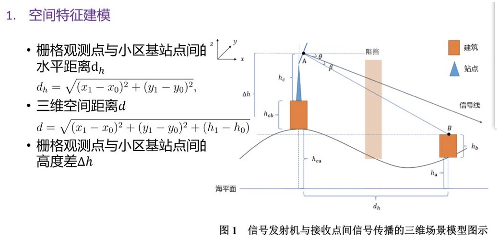
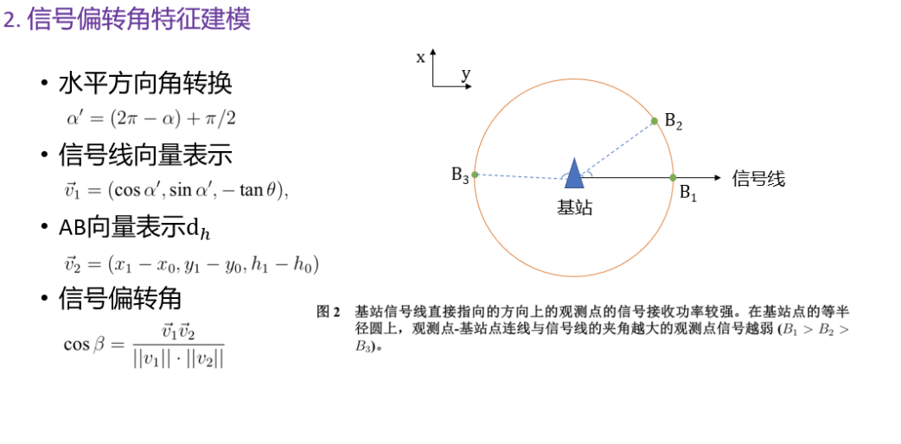
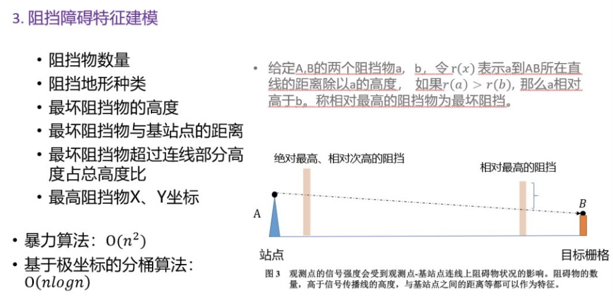

### B题：天文导航中的星图识别 （关键词：人工智能）

B题是很富有挑战性的一套题。**天文导航**是基于天体的已知的坐标定位和运动规律，观测天体的天文坐标值来确定航行体的空间位置等参数。与其他导航系统相比，天文导航是一种**自主导航**，不需要地面设备，不受人工或者自然形成的电磁场的干扰，不向外界辐射能量，隐蔽性非常好，而且定向、定位精度高，定位误差与时间无关，天体导航已广泛应用于卫星、航天飞机、远程弹道导弹等**航天器**。

其中选取了来自浙江大学*浙江大学夏骏鹏队*提出的天文导航中的星图识别建模思路，该队获得一等奖。

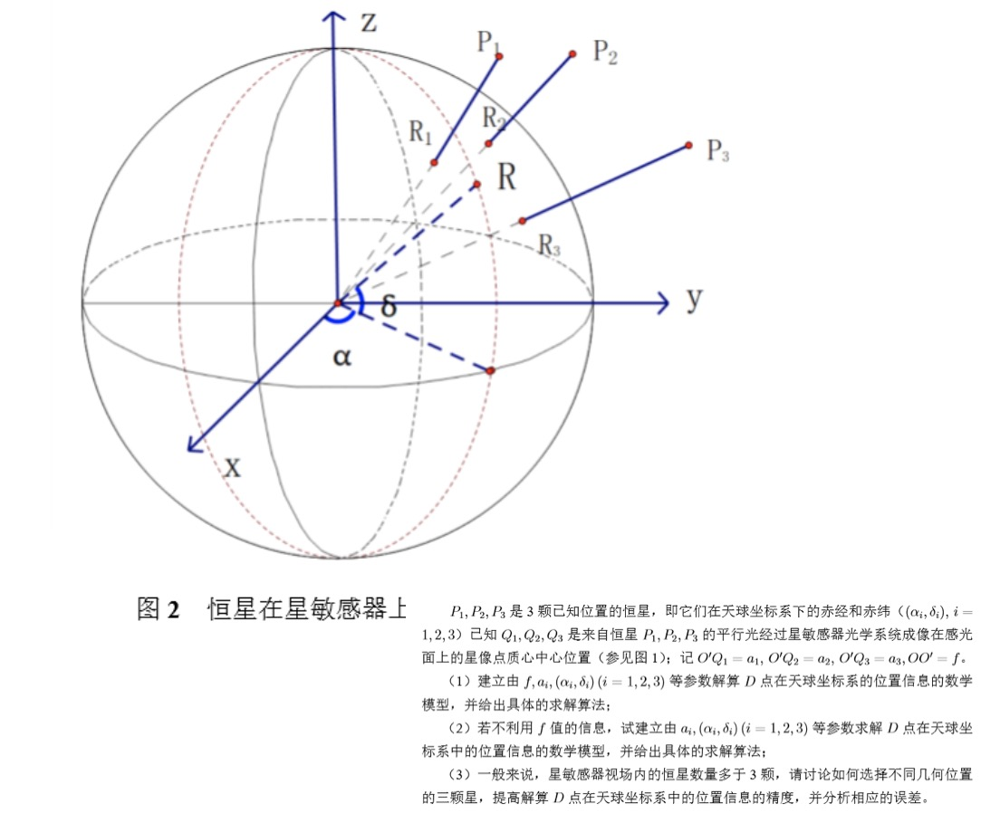
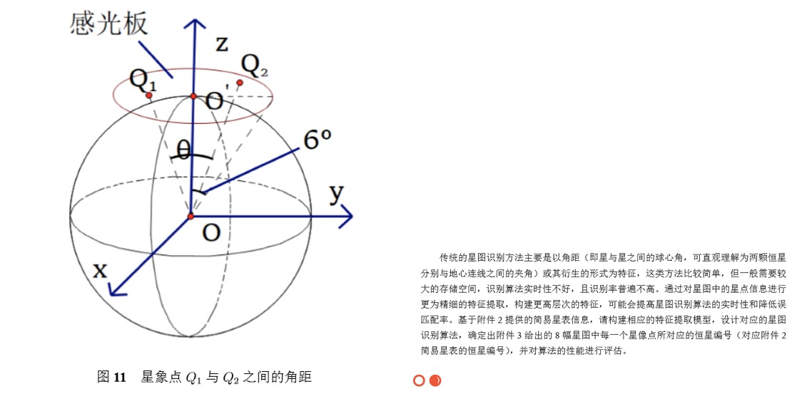

### C题：视觉情报信息分歧 （关键词：大数据分析）

C题也属于**人工智能**的范畴，现在人工驾驶技术发展迅速，一般人获得的信息80%来自视觉系统，视觉信息的主要载体是图像和视频，视觉情报就是指通过情报或者视频获取信息，提取物体特有的特征。比如，日本可以通过中国的一张画报来获取大庆油田的一些信息，现在当前热门的机器人、无人驾驶等都与命题内容是有关的，所以这个问题的切入点是作为问题的逆问题来提出的，很有特色。

其中选取了来自东南大学*东南大学伶飞贺队*提出的视觉情报信息分歧建模思路，该队获得一等奖。

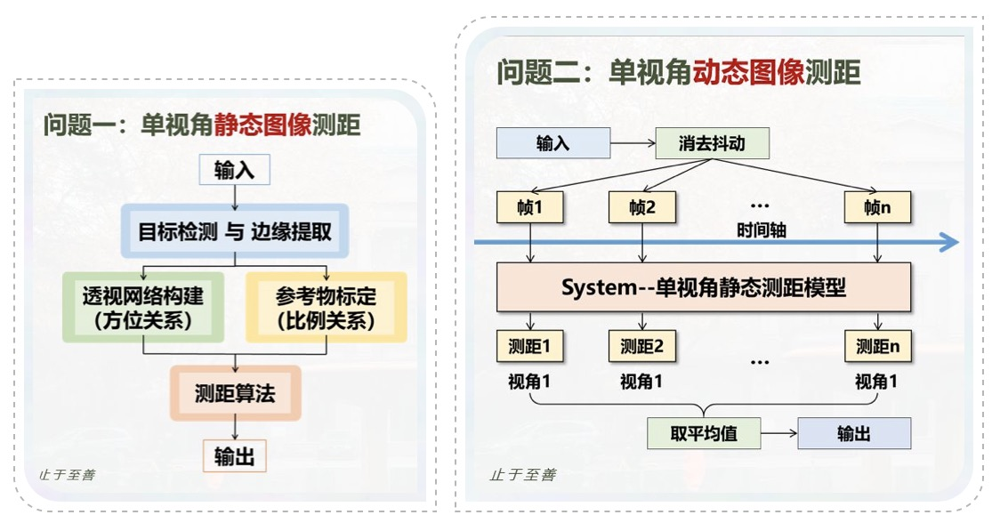
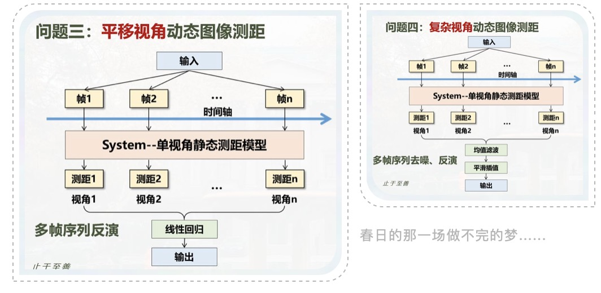

### D题：汽车行驶工况构建 （关键词：绿色环保）

D题是被参赛选手选择**最多**的一道题，这道题有很好的切入点，**专业入口非常广**。这道题属于绿色环保的主题，主要针对近年来我国道路交通状况与汽车增长之间的关系以及每一个城市道路特点与汽车实际耗油的关系。欧洲在多年的实践中发现了工况里形成的很多系统性不足的问题，针对这个问题，我国目前在北京、上海对于汽车的工况生成的大数据的分析也做了一定量的工作，这道题就是通过**数字特征**、**大数据分析**来分析**汽车和道路之间内在的关系**。

其中选取了来自福州大学*福州大学宇宙巨无霸队*提出的汽车行驶工况构建建模思路，该队获得一等奖。

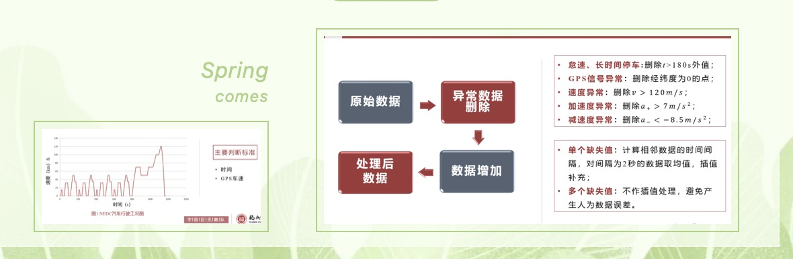
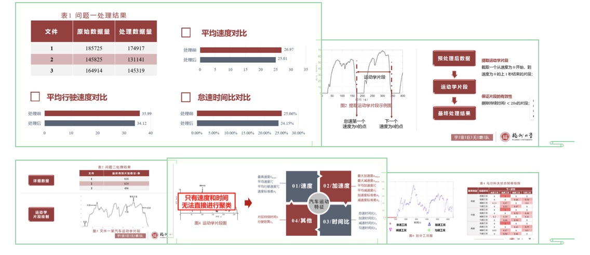

### E题：全球变暖 （关键词：气候变化）

E题是针对目前气候变化提出来的问题，许多科学家认为全球变暖会导致更多的其他极端气象的产生，导致全球降水量的重新分配，造成冰川消融、海平面上升等现象，威胁人类生存。这道题需要**利用现有的统计数据特征**，建立简化的**气候模型**和**极端天气模型**，区别于传统复杂的气候模型。希望研究生们做出一个简单的、实用的模型，有利于非专业的人士来理解和认识**全球气候变化的态势**，解释极端天气现象的发生，求证影响气候变化因素的**内在特征**，增强人们对于气候变化的认识，督促决策者迅速制定应对气候的政策。

其中选取了来自同济大学*同济大学Fighting之声队*提出的全球变暖建模思路，该队获得一等奖。

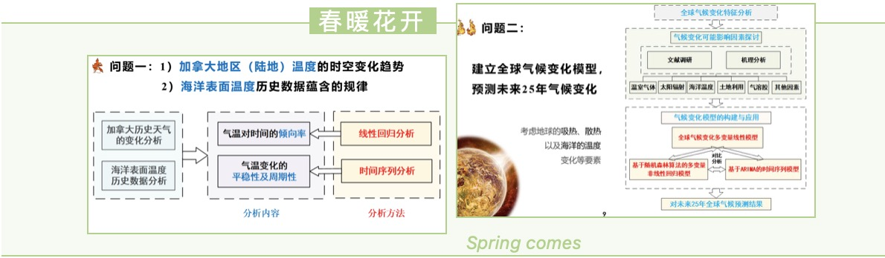
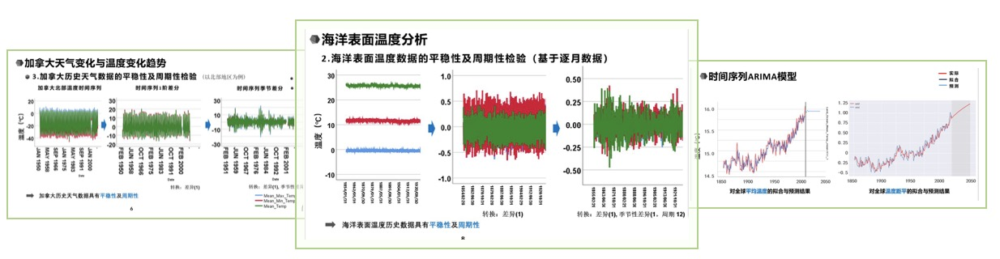

### F题：多约束条件下智能飞行器航迹快速规划 （关键词：飞行器航迹）

F题的命制是考虑到的是在飞行过程中，对**定位误差**进行**校对**是**智能飞行器规划**中非常重要的任务，主要是智能飞行器在精度定位有限制的条件下，来进行航迹快速规划的问题。